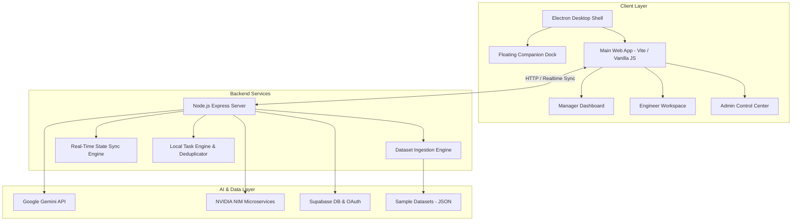

# TaskPilot AI

TaskPilot AI is a cross-platform AI desktop assistant and engineering management system for software developers, engineering managers, and platform administrators. It aggregates work across Jira, ServiceNow, GitHub, Outlook Emails, Slack, and meeting notes, removes duplicate tasks, extracts hidden action items from unstructured text, predicts delivery risks, and provides automated task assignment and sprint optimization.

The project is built as an Electron desktop application featuring an AI Floating Companion, an AI Task Prioritization & Sprint Genome Engine, real-time backend state synchronization, Supabase OAuth authentication, and dual AI integration with **Google Gemini API** and **NVIDIA NIM Microservices**.

---

## 🏗️ System Architecture

TaskPilot AI uses a decoupled, three-tier architecture with desktop shell orchestration, backend data pipelines, and multi-model AI reasoning:



### Architecture Breakdown

1. **Client Layer (Electron & Vite)**:
   - **Electron Shell**: Runs multi-window instances including the primary management app and an always-on floating desktop companion dock.
   - **Manager Workspace**: Sprint Genome Analyzer, Calendar AI resource allocator, Team Telemetry dashboard, and Engineer Performance Charts.
   - **Engineer Workspace**: Today's Smart Queue, execution briefs, time logging, and automated "complete & assign next" workflow.
   - **Admin Control Center**: Visual architecture pipeline canvas, live task scanning console, user management, and diagnostics error simulator.

2. **Backend & Core Engine (Node.js)**:
   - **Dataset Ingestion**: Aggregates signals from Jira, ServiceNow, GitHub, Outlook, Slack, and Meeting Notes.
   - **Task Deduplication & Prioritization**: NLP token overlap analysis, shared work ID matching, and multi-factor scoring (severity, deadline, blockers, duplicate confidence, owner pressure).
   - **Real-Time State Sync**: Syncs state (`live_state.json`), user completions, active working tasks, and team presence heartbeats across instances.

3. **AI & Cloud Infrastructure**:
   - **Google Gemini API**: Generates natural language execution briefs, task assignment reasoning, and sprint genome risk insights.
   - **NVIDIA NIM Microservices**: Fast-path LLM inference for companion chat and automated task scanning.
   - **Supabase & Google OAuth**: User authentication, RLS security policies, and user status presence.

---

## 🌟 Core Features

- **Multi-Source Signal Aggregation**: Collects tasks from Jira, ServiceNow, GitHub, Outlook, Slack, and meeting notes.
- **Sprint Genome Analyzer**: Computes historical sprint fingerprints (`buildCurrentGenome`), similarity scores (`computeGenomeSimilarity`), mutation alerts (`detectMutations`), and delivery risk predictions (`predictRisks`).
- **Calendar AI**: Resource planning engine that auto-allocates tasks across engineers based on daily capacity limits (7.5h/day), deadlines, severity, and historical velocity.
- **Team Workload & Telemetry**: Live active capacity meters, dependency blocker graphs, teammate task inspection, and one-click workload rebalancing (`simulateWorkloadShift`).
- **Engineer Performance Charts**: Multi-source activity line charts and per-engineer KPI cards (Assigned, Done, On Time, Late).
- **Floating Desktop Companion**: Always-on movable companion widget for quick commands, context scanning, and AI task guidance.
- **TEE-Style Approval Gates**: Approval-first security workflow for sensitive operations (handoffs, reassignments, task posting).

---

## 🛠️ Tech Stack

- **Frontend**: Vanilla JavaScript (ES6+), HTML5, CSS3
- **Desktop Shell**: Electron 34+
- **Build Tool**: Vite & Node.js scripts
- **Backend API**: Node.js, Express
- **Database & Auth**: Supabase PostgreSQL, Google OAuth
- **AI Models**: Google Gemini 2.5 Flash, NVIDIA NIM Nemotron
- **Testing**: Native Node.js Test Runner

---

## 📁 Project Structure

```text
Error-404/
├── backend/
│   └── taskpilotai/
│       ├── agent/                  # Agent orchestration & prioritization logic
│       ├── api/                    # API routes & helper modules
│       ├── datasets/               # Ingested sample datasets (Jira, ServiceNow, GitHub, etc.)
│       ├── supabase/               # SQL migrations & RLS policies
│       ├── .env.example            # Environment configuration template
│       ├── server.mjs              # Node.js backend server
│       └── package.json
├── frontend/
│   └── taskpilotai/
│       ├── electron/               # Electron main process & floating companion setup
│       ├── scripts/                # Build, serve, and dataset sync scripts
│       ├── src/                    # App UI views, task engine, TEE trust module
│       │   ├── main.js             # Main frontend application & routing
│       │   ├── taskEngine.js       # Priority scoring & deduplication engine
│       │   ├── teeTrust.js         # Approval-gated execution helper
│       │   └── styles.css          # Design system & component styles
│       ├── public/                 # Static assets & icons
│       └── package.json
└── README.md
```

---

## 🚀 Quick Start Guide

### Prerequisites
- Node.js 18.x or newer
- npm 9.x or newer
- macOS or Windows

### 1. Environment Setup

Copy `.env.example` in the backend directory:

```bash
cd backend/taskpilotai
cp .env.example .env
```

Example `.env` configuration:

```env
TASKPILOT_PORT=8787
TASKPILOT_DATASET_DIR=./datasets

LLM_PROVIDER=gemini
GEMINI_API_KEY=your_gemini_api_key_here
LLM_MODEL=gemini-2.5-flash

SUPABASE_URL=your_supabase_project_url
SUPABASE_ANON_KEY=your_supabase_anon_key
```

### 2. Installation

Install backend dependencies:
```bash
cd backend/taskpilotai
npm install
```

Install frontend dependencies:
```bash
cd frontend/taskpilotai
npm install
```

### 3. Running the App

Start the Backend Server:
```bash
cd backend/taskpilotai
npm run dev
```

Start Web Preview:
```bash
cd frontend/taskpilotai
npm run dev
```

Run Electron Desktop App:
```bash
cd frontend/taskpilotai
npm run desktop
```

Build Static Bundle:
```bash
cd frontend/taskpilotai
npm run build
```

---

## 🧪 Testing

Run task engine verification tests:

```bash
cd frontend/taskpilotai
npm test
```

Tests verify:
- Dataset ingestion & normalization.
- Text similarity & duplicate task merging.
- Multi-factor priority scoring.
- Calendar AI daily schedule generation.
- Sprint Genome mutation & risk detection.
- TEE payload sealing & approval gates.

---

## 📄 License

This project is licensed under the MIT License.
