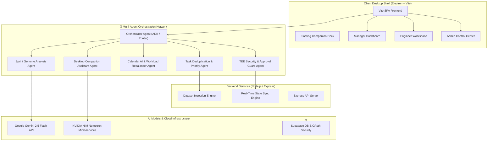

# TaskPilot AI

TaskPilot AI is a cross-platform AI desktop assistant and engineering management system for software developers, engineering managers, and platform administrators. It aggregates work across Jira, ServiceNow, GitHub, Outlook Emails, Slack, and meeting notes, removes duplicate tasks, extracts hidden action items from unstructured text, predicts delivery risks, and provides automated task assignment and sprint optimization.

The project is built as an Electron desktop application featuring an **Autonomous Multi-Agent System (MAS)**, an AI Floating Companion, an AI Task Prioritization & Sprint Genome Engine, real-time backend state synchronization, Supabase OAuth authentication, and dual AI integration with **Google Gemini API** and **NVIDIA NIM Microservices**.

---

## 🏗️ System & Multi-Agent Architecture

TaskPilot AI uses a decoupled, three-tier architecture powered by a cooperative **Multi-Agent Orchestration Network**:



---

## 🤖 Multi-Agent System (MAS) Breakdown

TaskPilot AI coordinates six specialized AI agents orchestrated via a central routing layer:

1. **Orchestrator Agent (ADK & Routing Layer)**:
   - Routes user queries, autonomous scans, and background events to appropriate sub-agents.
   - Coordinates multi-model task handoffs between Google Gemini 2.5 Flash and NVIDIA NIM.

2. **Task Deduplication & Prioritization Agent**:
   - Ingests raw multi-source streams (Jira, ServiceNow, GitHub, Outlook, Slack, Meetings).
   - Performs NLP token overlap, shared work ID correlation, and multi-factor SLA scoring (severity, deadlines, dependency risks, owner pressure).

3. **Sprint Genome Agent**:
   - Fingerprints historical sprint patterns (`buildCurrentGenome`).
   - Computes genome similarity scores, detects sprint mutation anomalies, predicts delivery risks, and generates automated mitigation strategies.

4. **Calendar AI & Workload Rebalancer Agent**:
   - Calculates real-time engineer capacity against daily work limits (7.5h/day).
   - Executes live workload rebalancing simulations (`simulateWorkloadShift`) to automatically equalize task loads across engineers.

5. **Desktop Companion Assistant Agent**:
   - Runs in an isolated floating Electron window.
   - Provides always-on ambient context assistance, quick actions, and proactive desktop notifications.

6. **TEE Trust & Security Guard Agent**:
   - Enforces approval-first security boundaries, payload redaction, and attestation sealing for sensitive operations (handoff approvals, task posting, data export).

---

## 🌟 Core Features

- **Multi-Source Signal Aggregation**: Collects tasks from Jira, ServiceNow, GitHub, Outlook, Slack, and meeting notes.
- **Sprint Genome Analyzer**: Computes historical sprint fingerprints, similarity scores, mutation alerts, and delivery risk predictions.
- **Calendar AI Resource Allocator**: Auto-balances tasks across engineers based on capacity, deadlines, severity, and historical velocity.
- **Team Workload Telemetry**: Real-time capacity meters, dependency blocker graphs, teammate task inspection, and one-click workload rebalancing.
- **Engineer Performance Charts**: Multi-source activity line charts and per-engineer KPI cards (Assigned, Done, On Time, Late).
- **Floating Desktop Companion**: Always-on movable companion widget for quick commands, context scanning, and AI task guidance.
- **TEE-Style Approval Gates**: Approval-first security workflow for sensitive operations (handoffs, reassignments, task posting).

---

## 🛠️ Tech Stack

- **Frontend**: Vanilla JavaScript (ES6+), HTML5, CSS3
- **Desktop Shell**: Electron 34+
- **Build Tool**: Vite & Node.js scripts
- **Backend API**: Node.js, Express
- **Database & Auth**: Supabase PostgreSQL, Google OAuth
- **AI Models**: Google Gemini 2.5 Flash, NVIDIA NIM Nemotron
- **Testing**: Native Node.js Test Runner

---

## 📁 Project Structure

```text
Error-404/
├── backend/
│   └── taskpilotai/
│       ├── agent/                  # Multi-agent orchestration & prioritization logic
│       ├── api/                    # API routes & helper modules
│       ├── datasets/               # Ingested sample datasets (Jira, ServiceNow, GitHub, etc.)
│       ├── supabase/               # SQL migrations & RLS policies
│       ├── .env.example            # Environment configuration template
│       ├── server.mjs              # Node.js backend server
│       └── package.json
├── frontend/
│   └── taskpilotai/
│       ├── electron/               # Electron main process & floating companion setup
│       ├── scripts/                # Build, serve, and dataset sync scripts
│       ├── src/                    # App UI views, task engine, TEE trust module
│       │   ├── main.js             # Main frontend application & routing
│       │   ├── taskEngine.js       # Priority scoring & deduplication engine
│       │   ├── teeTrust.js         # Approval-gated execution helper
│       │   └── styles.css          # Design system & component styles
│       ├── public/                 # Static assets & icons
│       └── package.json
└── README.md
```

---

## 🚀 Quick Start Guide

### Prerequisites
- Node.js 18.x or newer
- npm 9.x or newer
- macOS or Windows

### 1. Environment Setup

Copy `.env.example` in the backend directory:

```bash
cd backend/taskpilotai
cp .env.example .env
```

Example `.env` configuration:

```env
TASKPILOT_PORT=8787
TASKPILOT_DATASET_DIR=./datasets

LLM_PROVIDER=gemini
GEMINI_API_KEY=your_gemini_api_key_here
LLM_MODEL=gemini-2.5-flash

SUPABASE_URL=your_supabase_project_url
SUPABASE_ANON_KEY=your_supabase_anon_key
```

### 2. Installation

Install backend dependencies:
```bash
cd backend/taskpilotai
npm install
```

Install frontend dependencies:
```bash
cd frontend/taskpilotai
npm install
```

### 3. Running the App

Start the Backend Server:
```bash
cd backend/taskpilotai
npm run dev
```

Start Web Preview:
```bash
cd frontend/taskpilotai
npm run dev
```

Run Electron Desktop App:
```bash
cd frontend/taskpilotai
npm run desktop
```

Build Static Bundle:
```bash
cd frontend/taskpilotai
npm run build
```

---

## 🧪 Testing

Run task engine & multi-agent verification tests:

```bash
cd frontend/taskpilotai
npm test
```

Tests verify:
- Dataset ingestion & normalization.
- Text similarity & duplicate task merging.
- Multi-factor priority scoring.
- Calendar AI daily schedule generation.
- Sprint Genome mutation & risk detection.
- TEE payload sealing & approval gates.

---

## 📄 License

This project is licensed under the MIT License.
